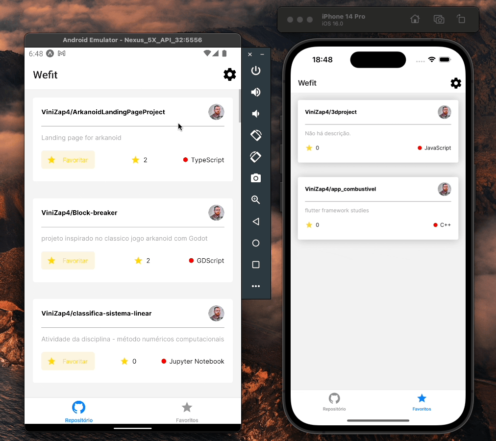

# Wefit

Uma aplicação para visualizar e salvar respositórios do github.

----
A aplicação foi feita com [Expo](https://expo.dev/) então para poder executar será necessario ter o `npm` instalado.

para baixar todas as dependencias basta executar `npm i` ou `npm install` na raiz do projeto.

E `npm start` para inicializar o projeto.

---

A partir de duas telas uma para ver os repositórios de um usuário selecionado e outra para os repositórios que estão salvos como favoritos. sendo os favoritos salvos de forma local.

Abrindo os cards é possível ver mais sobre o repositórios e abrir a url dele no navegador

